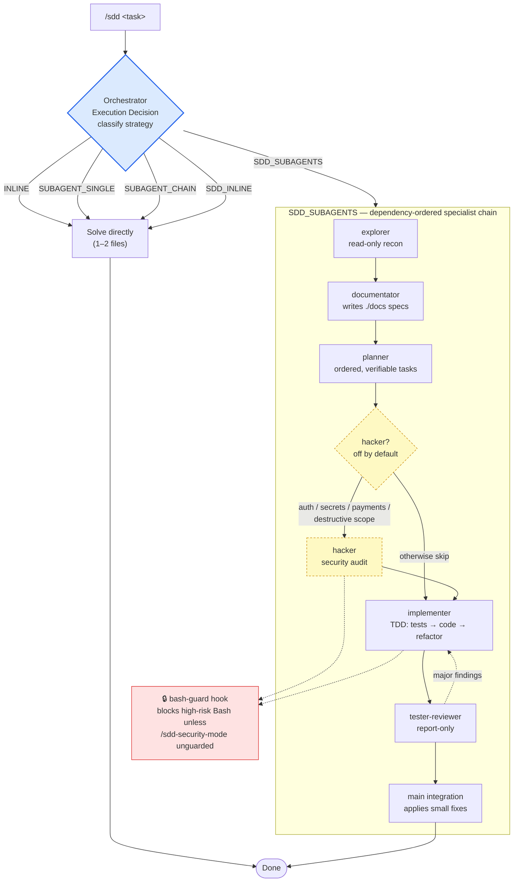

# claude-sdd-team

A Claude Code plugin that brings a structured, multi-agent Software-Driven Development (SDD) team to any project. Six specialist subagents — explorer, documentator, planner, implementer, tester-reviewer, and hacker — work in a strict dependency chain coordinated by an opt-in orchestrator command.

---

## Install

```
claude plugin marketplace add skydiver/claude-sdd-team
claude plugin install claude-sdd-team@skydiver
```

---

## What you get

### Agents

| Agent             | Role                                                                                                                                                                                     |
| ----------------- | ---------------------------------------------------------------------------------------------------------------------------------------------------------------------------------------- |
| `explorer`        | Read-only recon: maps files, interfaces, and dependencies; produces a compact handoff. Runs on Haiku for speed.                                                                          |
| `documentator`    | Writes `./docs/functional-spec.md` and `./docs/technical-spec.md` from the explorer handoff.                                                                                             |
| `planner`         | Turns specs into an ordered, verifiable task list for the implementer.                                                                                                                   |
| `implementer`     | Implements features TDD-style (tests → code → refactor) from the planner handoff.                                                                                                        |
| `tester-reviewer` | Report-only static and E2E validation — flags issues but never modifies code.                                                                                                            |
| `hacker`          | Security audit (static + dynamic). **Disabled by default**; runs only when you explicitly request a security review or the task touches auth, secrets, payments, or destructive actions. |

### Commands

| Command              | Arguments            | Purpose                                                                              |
| -------------------- | -------------------- | ------------------------------------------------------------------------------------ |
| `/sdd`               | `<task>`             | Classify the task, state an Execution Decision, and coordinate the specialist chain. |
| `/sdd-subagents`     | —                    | List all available specialist agents with their roles and tools.                     |
| `/sdd-status`        | —                    | Show current security mode and which agents are enabled.                             |
| `/sdd-security-mode` | `guarded\|unguarded` | Switch between guarded (default, blocks high-risk Bash) and unguarded mode.          |

---

## How it works

You invoke `/sdd <task>`. The main session becomes the **orchestrator**: it writes an Execution Decision that classifies the task into one of five strategies. Light tasks are handled directly; full feature work fans out to the specialist chain, which runs in strict dependency order. A `bash-guard` hook gates high-risk shell commands the whole time, based on the current security mode.



> Fan-out is allowed _within_ a phase (e.g. three explorers over auth/db/api in parallel), but phases never reorder. If `tester-reviewer` finds major issues, work loops back to `implementer`; trivial fixes are applied directly during main integration.

---

## Usage

### `/sdd <task>` — opt-in orchestration

Running `/sdd <task>` puts the main Claude Code session in the role of orchestrator. Before doing any substantial work it writes an **Execution Decision** that names the strategy and expected validation. Five strategies are available:

| Strategy          | When to use                                                                 |
| ----------------- | --------------------------------------------------------------------------- |
| `INLINE`          | Small, low-risk change (1–2 files). Solved directly.                        |
| `SUBAGENT_SINGLE` | One bounded specialist task (recon, docs, or focused review).               |
| `SUBAGENT_CHAIN`  | Multi-step work without full SDD: explorer → implementer → tester-reviewer. |
| `SDD_INLINE`      | SDD is justified but light enough to do in a single session.                |
| `SDD_SUBAGENTS`   | Full specialist chain for larger or riskier work.                           |

#### SDD_SUBAGENTS execution order

The full chain runs in strict dependency order — no phase starts before the previous one returns:

```
explorer  →  documentator  →  planner  →  [hacker]  →  implementer  →  tester-reviewer  →  main integration
```

Fan-out is allowed within a phase (e.g., three explorers over auth/db/api in parallel), but phases never reorder.

### Other commands

- **`/sdd-subagents`** — prints a catalogue of every specialist with its model, allowed tools, and one-line role description.
- **`/sdd-status`** — shows the current security mode and lists which agents are currently enabled.
- **`/sdd-security-mode guarded|unguarded`** — switches security mode and writes the new state to `.claude/.security-mode`.

---

## Security model

Two **independent** controls govern security-sensitive work. Turning one on does **not** turn the other on.

| Control           | What it decides                                       | Default   | How to change                                                                       |
| ----------------- | ----------------------------------------------------- | --------- | ----------------------------------------------------------------------------------- |
| **Hacker agent**  | Whether a security audit runs at all                  | Off       | Ask for a security review, or work on auth / secrets / payments / destructive scope |
| **Security mode** | Whether high-risk Bash is allowed — for _every_ agent | `guarded` | `/sdd-security-mode unguarded`                                                      |

They meet in exactly one place: a deep audit that needs destructive commands requires unguarded mode. But unguarded mode lifts the block for **all** agents, not just the hacker (see fidelity note 1). The hacker can still run a complete _guarded_ audit without unguarded mode — it simply avoids destructive commands.

### Security mode in detail

Security mode controls whether high-risk Bash commands are allowed.

**Guarded (default)** — the `bash-guard` PreToolUse hook intercepts every Bash call and blocks commands matching high-risk patterns: `rm -rf`, `git reset --hard`, `git clean -fd`, `dd if=`, `mkfs`, and fork bombs. The session exits with a non-zero code if any of these patterns are detected while in guarded mode.

**Unguarded** — the same hook runs, but the block is lifted. Use unguarded mode intentionally, e.g. when the `hacker` agent needs to exercise destructive test paths.

State is stored at `${CLAUDE_PROJECT_DIR}/.claude/.security-mode` (plain text: `guarded` or `unguarded`). The file is read on every Bash call; switching modes takes effect immediately without restarting the session.

Switch via the command: `/sdd-security-mode unguarded` or `/sdd-security-mode guarded`.

---

## Requirements

- **`python3`** must be available in the shell PATH. The `bash-guard` hook uses it to parse JSON from the PreToolUse event. If `python3` is not available, swap the parsing line in `hooks/bash-guard.sh` to use `jq` instead.

---

## Credits

Adapted for Claude Code from [ram4-dev/multi-sdd-team](https://github.com/ram4-dev/multi-sdd-team), an SDD multi-agent framework originally built for the `pi` coding agent. The role design, orchestration strategies, and guardrail concepts originate there; this project ports them to Claude Code's plugin primitives (agents, slash commands, and hooks). The [Fidelity notes](#fidelity-notes) below describe where this port's runtime guarantees differ from that original.

---

## Fidelity notes

These are known gaps between the [original design intent](#credits) and what this plugin can enforce at runtime:

1. **bash-guard enforces the guarded-mode block, not the hacker-role-only gate.** The PreToolUse hook intercepts every Bash call regardless of which subagent issued it. It blocks high-risk commands in guarded mode for all agents — including the `hacker`. But the hook cannot identify which subagent is dispatching a call, so it cannot enforce "only `hacker` may run destructive commands in unguarded mode." In unguarded mode, any agent can run high-risk Bash. Guard this with process discipline rather than tooling.

2. **Orchestration is prompt-driven, not programmatic.** `/sdd` is a strong default prompt that guides Claude through the Execution Decision and specialist chain. It is not a hard state machine. The session can deviate if prompted to do so. Treat it as a consistently enforced convention, not an unbreakable rail.

3. **`documentator`'s docs-only constraint is prompt-only.** The plugin manifest does not support per-agent hooks, so there is no hook that prevents `documentator` from writing files outside `./docs/`. The constraint exists only in the agent's system prompt.

---

## License

Released under the [MIT License](LICENSE).
